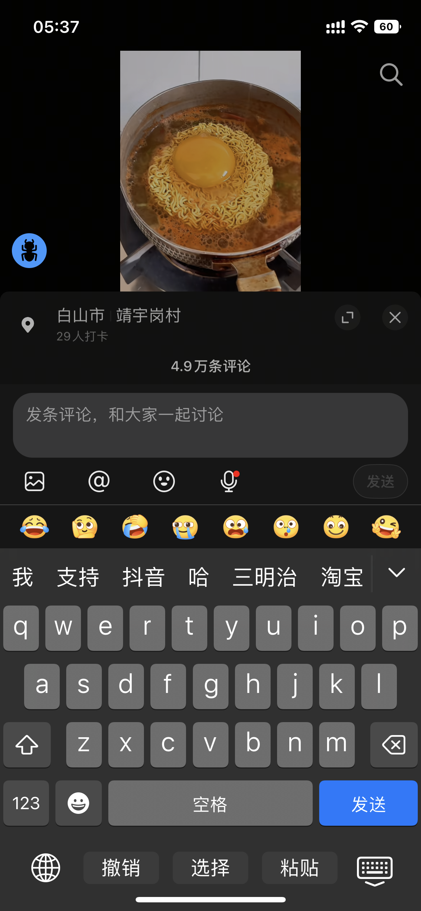
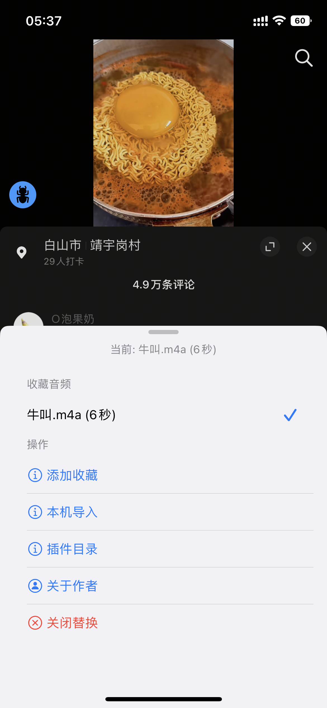
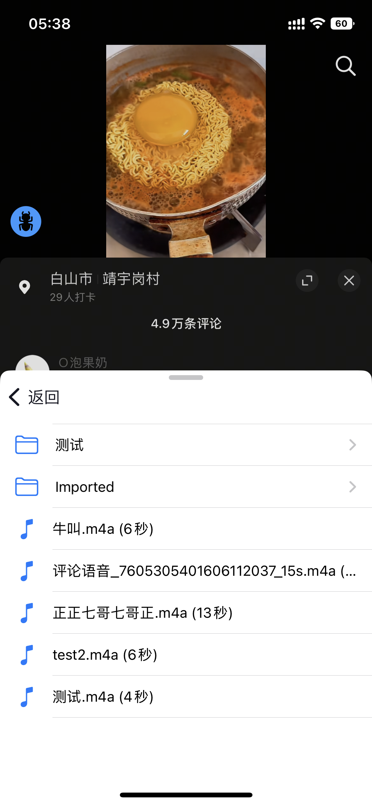
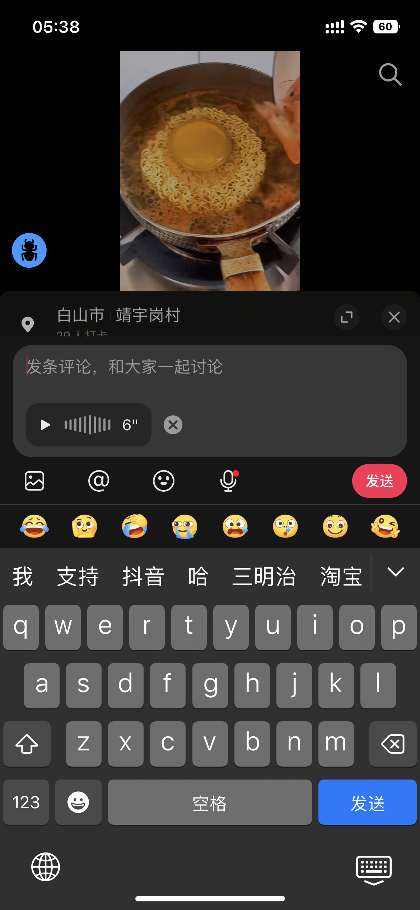
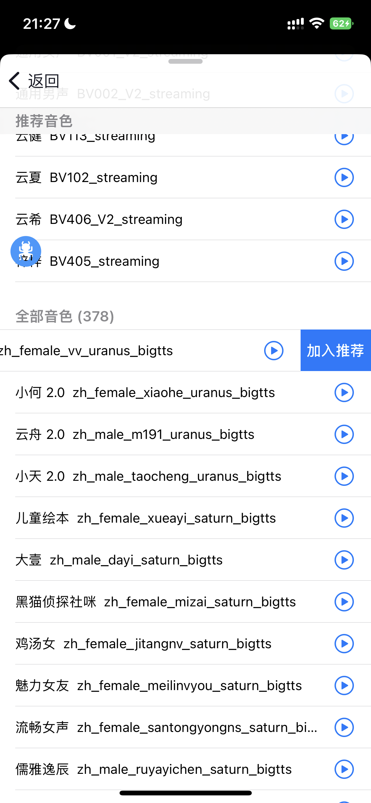
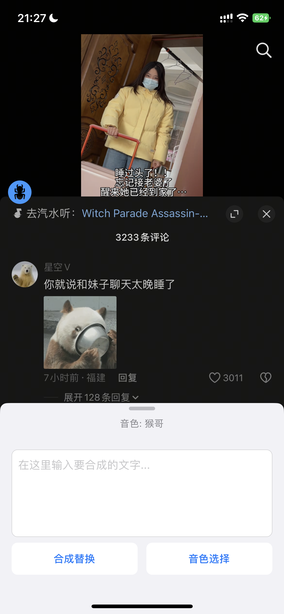

# AWECommentAudioTweak

抖音评论区语音下载 & 录制替换 & AI 语音合成插件。

## 功能

- 长按语音评论弹出保存对话框，从 CDN 直链下载语音文件
- 语音按钮长按打开音频选择面板，选择替换音频后发送语音自动替换
- 收藏夹管理，快速切换常用音频
- 支持本机导入音频/zip，自动解压和转码
- 插件沙盒目录浏览，按文件夹分类管理
- 替换状态红点提示，导航栏显示当前替换音频
- AI 语音合成：支持火山引擎（300+ 音色）和千问 TTS（49 音色）双后端
- 音色试听、推荐音色管理、语速/音量/音调参数调节（火山引擎）

## 截图

| 长按保存 | 替换状态 | 选择面板 |
|:---:|:---:|:---:|
|  |  |  |

| 收藏说明 | 插件目录 | 替换成功 |
|:---:|:---:|:---:|
|  |  |  |

| 加入推荐 | 输入合成 | 音色选择 |
|:---:|:---:|:---:|
|  |  |  |

## 使用方法

1. 编译 dylib：`make -C AWECommentAudioTweak`
2. 通过 TrollTools 注入抖音
3. 播放一条语音评论后长按即可保存
4. 长按评论输入栏的语音按钮打开选择面板
5. 选择音频后发送语音评论即自动替换语音内容

## AI 语音合成

评论输入栏语音按钮旁的云朵图标即为 AI 合成入口。输入文字，选择音色，点击"合成替换"即可生成语音并自动设为替换音频。

### 配置火山引擎 TTS API

AI 语音合成功能基于[火山引擎语音合成](https://www.volcengine.com/product/tts)服务，使用前需要配置 API 凭证：

1. 注册[火山引擎账号](https://console.volcengine.com/)
2. 进入控制台，开通「语音技术」→「语音合成」服务
3. 创建应用，获取 App ID
4. 在「语音合成」→「音色管理」中选择需要的音色并开通授权
5. 进入「API Key 管理」，创建并复制 Access Token
6. 在插件的音频选择面板中点击「音色合成」，进入配置页填写：
   - App ID：你的应用 ID
   - Access Token：你的 API 密钥
   - Cluster：一般填 `volcano_tts`（默认值，可留空）

配置保存后即可使用 AI 语音合成功能。

### 音色选择

插件内置 300+ 火山引擎官方音色，涵盖：

- 通用场景（灿灿、通用男女声等）
- 角色扮演（霸道总裁、温柔男友、高冷御姐等）
- 多情感音色（支持情感表达的增强版本）
- IP 仿音（鲁班七号、猪八戒等）
- 趣味口音（粤语、川话、京腔等）
- 多语种（英语、西班牙语、日语等）
- 客服/有声阅读/视频配音等专业场景

支持搜索、试听、推荐音色管理（左滑加入/移除推荐）。

### 配置千问 TTS API

插件同时支持[阿里云百炼千问语音合成](https://help.aliyun.com/zh/model-studio/qwen-tts)服务，内置 49 个系统音色，涵盖普通话、方言、多语种。

1. 注册[阿里云账号](https://account.aliyun.com/)
2. 进入[百炼控制台](https://bailian.console.aliyun.com/)
3. 点击右上角「API Key 管理」，创建并复制 API Key（格式为 `sk-xxx`）
4. 在插件配置页的「千问 TTS」区域填写 API Key

选择音色时点击「音色选择」，弹出选择框选择「千问 TTS」即可进入千问音色列表。

千问音色包括：

- 普通话音色（芊悦、晨煦、苏瑶、千雪等 25 个）
- 多语种音色（西语、俄语、意语、韩语、日语、德语、法语、葡语）
- 方言音色（上海话、北京话、四川话、粤语、闽南语等）

## 环境要求

- iOS 15.0+
- Theos 编译环境
- TrollTools 注入

## 作者

[@cookieodd](https://github.com/cookieodd) | [Telegram](https://t.me/cookieodd)
